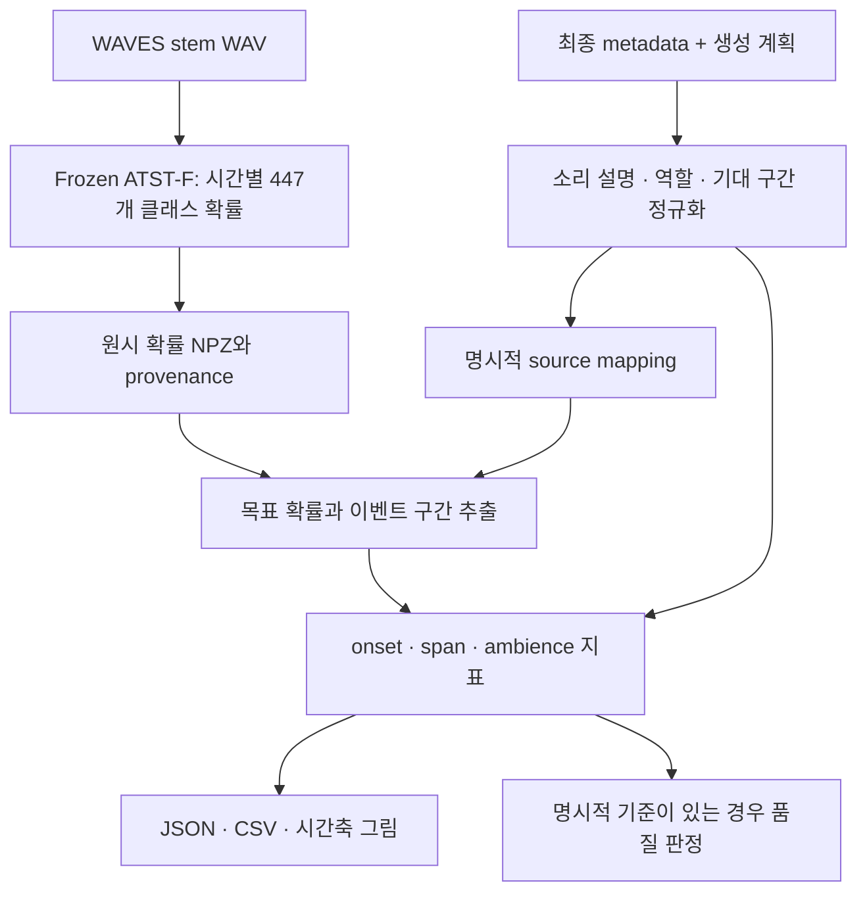

# WAVES stem SED validation

WAVES가 생성한 개별 소리 트랙(stem)의 소리 종류와 시간적 일관성을 평가하는 독립 후처리
도구이다. 소리 종류와 발생 시간을 찾는 SED(Sound Event Detection)에 ATST-F Strong 모델을
사용한다. 모델 가중치를 고정한 채 시간별 확률을 계산하고, 생성 계획과 비교하여
지표·시각화·설정 기반 판정을 제공한다. WAVES 생성 코드는 수정하지 않으며 모델의 학습이나
fine-tuning도 수행하지 않는다.

현재 구현은 단일·batch 추론, metadata 정규화, 수동 source mapping, 역할별 시간 평가,
시각화, controlled corruption, 선택적 판정을 포함한다. **실제 WAVES 생성 음원에서의
성능 검증과 운영 threshold 보정은 아직 수행하지 않았다.**

## 평가 흐름



모델 추론, 이벤트 추출, 품질 판정의 설정을 분리한다. 계산한 확률을 저장한 cache를 생성하면
검출 threshold·smoothing·판정 정책을 변경할 때 같은 확률을 재사용할 수 있다.
비교 시간 기준(reference)의 기본값은 WAVES의 **생성 계획**이므로 결과는 계획과 음원의 내부 일관성을
나타낸다. 실제 영상과의 동기화를 확인하려면 독립적인 시간 주석이 필요하다.

## 역할별 평가와 입출력

| 역할 | 평가 대상 | 주요 지표 |
| --- | --- | --- |
| `onset` | 짧은 이벤트의 횟수와 시작 시점 | 최적 일대일 matching, 누락·추가 이벤트, recall·precision, 시작 오차(ms) |
| `span` | 목표 소리가 차지하는 구간 | 구간 합집합의 temporal IoU·coverage·precision, 경계 오차, 구간 밖 활성 시간(s) |
| `ambience` | 기대 구간에서의 지속성 | occupancy, 시간 가중 원시 목표 확률, 구간 밖 활성 시간(s) |

Source mapping은 최종 소리 설명을 모델의 실제 class ID에 연결한다. 명시한 alias만 사용하며
여러 허용 클래스가 있으면 시점별 최대 확률을 목표 확률로 집계한다. `supported`는 평가할
column을 연결할 수 있다는 뜻이며 실제 검출이나 품질 통과를 의미하지 않는다.

| 입력 | 용도 |
| --- | --- |
| 최종 stem WAV | 모델 추론과 파형 표시 |
| Final metadata와 SAM manifest 또는 DSP report | 최종 label·role과 계획된 시간 구간 연결 |
| Source mapping JSON | 최종 설명과 허용 클래스의 명시적 대응 |
| Evaluation JSON | 검출 threshold, smoothing, 최소 이벤트 길이, onset matching 허용오차 |
| 선택적 filter JSON | 계산된 지표에 적용할 PASS·REVIEW·FAIL 경계 |

최종 WAVES metadata에는 description과 `activity_intervals`가 없으므로 중간 자료를
candidate ID로 조인한다. Relabel·role 변경·merge 이력을 보존하고, semantic merge에서는
선택된 parent의 계획 구간만 사용한다. 누락된 시간 구간이나 음원 경로는 추정하지 않는다.

주요 출력은 원시 NPZ, 정규화 stem JSON, `prediction-index.json`, stem·clip별 JSON,
`dataset.json`, `stems.csv`, `clips.csv`, PNG/SVG 그림과 HTML 목록이다. 입력·모델·설정의
출처와 SHA-256을 기록하며, 사용할 수 없는 지표는 0 대신 `null`과 사유로 남긴다.

## 기술과 설치

| 기술 | 역할 |
| --- | --- |
| Python·NumPy | CLI, 확률 배열, 이벤트 처리, 시간 지표와 보고서 |
| PyTorch·torchaudio·einops | 고정 ATST-F 모델 실행, mel 및 patch 변환 |
| librosa·soundfile | 오디오 읽기·리샘플링, 변형 WAV 저장 |
| AudioSet ontology | 클래스 계층과 ID 확인 |
| Matplotlib | 파형·확률·기대 및 검출 구간 시각화 |
| pytest·Ruff | 동작 검증, lint와 format 검사 |

검증 환경은 Windows·Python 3.11.9·CPU이다. WAVES와 별도 가상환경을 사용한다.
아래 작업 경로와 이후의 `C:/path/to/...`, `C:/runs/demo/...`는 예시이며 실제 경로로 대체한다.
기존 `.venv`가 있으면 환경 생성은 생략한다.

```powershell
cd C:\multitrack-audio-filtering
uv venv --python 3.11 .venv
uv pip install --python .venv/Scripts/python.exe -r requirements-cpu.txt

# 시각화와 파형 변형을 사용할 경우 선택 설치
uv pip install --python .venv/Scripts/python.exe -e ".[visualization,corruption]"

# 공식 약 329 MiB checkpoint 다운로드. 기존 파일은 SHA-256을 검증한다.
.venv/Scripts/python.exe -m waves_sed download
```

`uv` 대신 `py -3.11 -m venv .venv`와
`.venv/Scripts/python.exe -m pip install -r requirements-cpu.txt`를 사용할 수 있다.
기본 패키지는 NumPy만 요구하며, `[atst]`는 새 모델 추론, `[visualization]`은 그림,
`[corruption]`은 변형 음원 생성에 필요한 선택 의존성이다. CPU requirements는 추론과 개발
의존성을 설치한다. Cache 조회·평가·판정에는 모델이나 checkpoint가 필요하지 않다.

CUDA 실행은 검증하지 않았다. CUDA 환경에서는 해당 플랫폼과 호환되는 torch/torchaudio
2.10.0 및 `.[atst]`를 설치하고 추론에 `--device cuda`를 지정한다. CUDA를 요청하였으나
사용할 수 없는 경우 새 추론은 오류를 반환한다.

## 기본 실행 순서

### 1. 단일 WAV 추론

```powershell
.venv/Scripts/python.exe -m waves_sed infer C:/path/to/stem.wav --output outputs/predictions/stem.npz --device cpu --threads 4
.venv/Scripts/python.exe -m waves_sed inspect outputs/predictions/stem.npz --csv outputs/predictions/stem.csv
```

입력을 mono·16 kHz로 변환하여 추론한다. 같은 입력과 모델의 유효한 cache가 있으면
재사용하며, 다른 입력이나 손상된 cache를 자동 덮어쓰지 않는다. 새 추론을 강제할 때는
`--overwrite`를 지정한다. 단일 추론은 모델 동작을 확인하는 경로이며, 여러 stem의 평가는
아래의 metadata 정규화와 batch 명령으로 연결한다.

### 2. WAVES metadata 정규화와 mapping

```powershell
.venv/Scripts/python.exe -m waves_sed adapt-waves --metadata C:/runs/demo/final/clip_01/metadata.json --sam-manifest C:/runs/demo/sam_manifest.json --mappings configs/source_mappings.example.json --output outputs/stems.json
.venv/Scripts/python.exe -m waves_sed map-source --description "dog barking" --mappings configs/source_mappings.example.json
```

SAM manifest 대신 `--dsp-report`를 사용할 수 있으며, 둘 다 지정하면 계획 필드의 일치
여부를 검사한다. Mapping 설정은 실제 최종 label에 맞게 작성한다. 예제에 없는 설명은
`unsupported_mapping`으로 남는다.

Frozen JSON은 다음과 같이 정규화한다. 이 명령만으로 실제 음원 경로가 생기지는 않는다.

```powershell
.venv/Scripts/python.exe -m waves_sed adapt-waves --frozen-finals C:/WAVES/data/frozen_pass2/frozen_finals.json --frozen-reports C:/WAVES/data/frozen_pass2/frozen_reports.json --mappings configs/source_mappings.example.json --output outputs/frozen-stems.json
```

Frozen 음원을 연결하려면 명시적 `audio_id → path` 객체를 담은 파일을 `--audio-paths`로
전달한다. 상대 경로의 기준과 정규화 schema는 [Phase 3 문서](docs/phase3-validation.md)에 있다.
[검토 후보 mapping](configs/source_mappings.frozen-review.json)은 frozen 62개 중 **23개**를
연결하며, 생성 음원에서 인식 정확도를 검증한 설정은 아니다.

### 3. 여러 stem의 추론

```powershell
.venv/Scripts/python.exe -m waves_sed batch-infer --stems outputs/stems.json --output-dir outputs/batch
```

하나의 frozen 모델로 여러 stem을 처리하고 유효한 cache는 재사용한다. 일부 stem이 실패해도
나머지 결과를 보존한다. `batch-status.json`에 실패 사유를 기록하고, 성공한 cache만
`prediction-index.json`에 연결한다. 실패가 하나라도 있으면 종료 코드는 1이다.

### 4. 시간 지표와 보고서 생성

```powershell
.venv/Scripts/python.exe -m waves_sed evaluate --stems outputs/stems.json --predictions outputs/batch/prediction-index.json --mappings configs/source_mappings.example.json --config configs/evaluation.example.json --output-dir outputs/reports
```

Prediction index는 `{"schema_version":1,"predictions":{"실제 stem_id":"../predictions/stem.npz"}}`
형식이며 상대 경로는 index 파일 기준이다. Source/cache SHA-256과 전체 관측 시간축을
검사한다. WAVES 계획이 `ambiguous`이면 기본적으로 시간 지표 계산에서 제외한다.
역할별 측정 단위와 unavailable 사유는 [Phase 4 문서](docs/phase4-validation.md)에 있다.

### 5. 시간축 시각화

```powershell
.venv/Scripts/python.exe -m waves_sed visualize --stems outputs/stems.json --predictions outputs/batch/prediction-index.json --mappings configs/source_mappings.example.json --config configs/evaluation.example.json --output-dir outputs/visuals
```

`outputs/visuals/index.html`에 stem별 그림을 모은다. 원본 파형의 min/max, 기대 구간,
raw/median 목표 확률과 검출 구간을 같은 시간축에 표시한다. 기본 PNG 대신 `--format svg`를
지정하거나 `--stem-id "실제 ID"`로 한 stem만 선택할 수 있다.

## 설정 기반 판정

`evaluate`와 `visualize`에 `--filter-config`를 추가하면 지표에 판정 정책을 적용한다.
[기본 설정](configs/filter.example.json)의 threshold는 모두 `null`이며 기본적으로 판정은
비활성이다. 검출 threshold와 품질 판정 threshold는 서로 다른 설정이다.

```powershell
.venv/Scripts/python.exe -m waves_sed evaluate --stems outputs/stems.json --predictions outputs/batch/prediction-index.json --mappings configs/source_mappings.example.json --config configs/evaluation.example.json --filter-config configs/filter.example.json --output-dir outputs/filtered-reports
```

| 결과 | 의미 |
| --- | --- |
| `PASS` | 사용 가능한 근거에서 해당 역할의 활성 기준을 모두 충족 |
| `FAIL` | 사용 가능한 근거에서 활성 기준의 실패 조건에 해당 |
| `REVIEW` | 근거 누락·모호함, 필요한 지표 부재 또는 경계 사이의 검토 구간 |
| `UNSUPPORTED` | 활성 정책에서 역할이나 mapping을 지원하지 않음 |
| `null` | 판정 정책이 없거나 해당 역할의 기준이 비활성 |

숫자 또는 `{"pass": 값, "fail": 값}`으로 경계를 지정한다. Onset은 recall과 평균 시작 오차,
span은 temporal IoU, ambience는 occupancy를 판정에 사용할 수 있다. 조건별 지표값·경계·사유를
보고서와 그림에 기록한다. Outside-family 활성도는 자동 실패 조건으로 사용하지 않는다.
PASS는 설정한 조건의 충족이며 전체 음질이나 영상 동기화를 보증하지 않는다.
파일을 자동 삭제하거나 이동하지 않는다. [판정 순서와 예제](docs/phase7-validation.md)에
상세 계약이 있으며, 운영 경계값은 실제 검증 자료를 바탕으로 별도 보정해야 한다.

## Controlled corruption

원본 대조군을 보존하면서 시간 이동, 구간 삭제·복제, 길이 단축·반복 연장을 생성한다.
각 변형은 원본에서 독립적으로 만들며 기대 시간 구간은 그대로 유지한다. 변형 WAV를 새로
추론한 뒤 원본 대비 지표와 검출 구간의 변화를 비교하여 평가기의 반응을 확인한다.

```powershell
.venv/Scripts/python.exe -m waves_sed corrupt --stems outputs/stems.json --stem-id "실제 stem ID" --config configs/corruption.example.json --output-dir outputs/corruption/experiment
.venv/Scripts/python.exe -m waves_sed batch-infer --stems outputs/corruption/experiment/stems.json --output-dir outputs/corruption/batch
.venv/Scripts/python.exe -m waves_sed evaluate --stems outputs/corruption/experiment/stems.json --predictions outputs/corruption/batch/prediction-index.json --mappings configs/source_mappings.example.json --config configs/evaluation.example.json --output-dir outputs/corruption/reports
.venv/Scripts/python.exe -m waves_sed compare-corruptions --experiment outputs/corruption/experiment/experiment.json --report outputs/corruption/reports/dataset.json --output-dir outputs/corruption/comparison
```

생성에는 기존 실험과 겹치지 않는 새 출력 경로를 사용한다. 원본 길이·채널·sample rate를
유지하며 잘린 구간, 중첩 및 실제 변형 여부를 기록한다. 편집 구간은 대상 음원에 맞게
설정한다. 복제가 독립된 추가 이벤트 검출을 보장하지는 않는다. 변형 정책과 공개 음원
실험 결과는 [Phase 6 문서](docs/phase6-validation.md)에 있다.

## 원시 확률 형식

NPZ는 pickle 없이 읽으며, smoothing·이벤트 추출·품질 판정을 적용하기 전의 결과이다.

| 필드 | 형식과 의미 |
| --- | --- |
| `schema_version` | 현재 1 |
| `probabilities` | float32 `[T, 447]`, sigmoid 이후 클래스별 확률 |
| `frame_start_seconds`, `frame_end_seconds` | float64 `[T]`, 초 단위 bin `[start, end)` |
| `class_ids`, `class_names` | checkpoint의 출력 순서에 대응하는 문자열 447개 |
| `metadata_json` | 입력·모델 hash, upstream revision, 전처리·chunk 정책, sample rate, 의존성 버전 |

10초 chunk마다 250개 frame을 계산한다. 마지막 chunk는 zero padding하되 padding-only
frame은 저장하지 않고 마지막 bin 끝은 원본 WAV 길이로 제한한다. 리샘플링된 sample의
길이는 `resampled_duration_seconds`로 구분한다. 40 ms는 출력 간격이며 이벤트 경계의
정확도를 보장하지 않는다. Transformer는 chunk 전체 문맥을 사용하며 10초 경계에서 문맥이 끊긴다.

```python
from waves_sed.prediction import FramePrediction

prediction = FramePrediction.load("outputs/predictions/stem.npz")
print(prediction.probabilities.shape)
print(prediction.class_ids[0], prediction.class_names[0])
```

모델의 447-class vocabulary와 공식 ontology는 서로 다른 자료이며 class ID로 연결한다.
공식 archive에는 모델 ID 31개가 없고, 공통 ID 중 11개는 표시명이 다르다. 차이를 기록하고
없는 계층 관계를 추정하지 않는다.

## 검증 범위와 남은 과제

Phase 1~7의 구현 검증에는 공개 예제 WAV, 실제 WAVES frozen metadata, 합성 구간 및 변형
음원을 사용하였다. Phase 7 완료본의 전체 테스트 기록(문서 commit `adb0a4f`)은
**1,019 passed, 1 skipped**이다. 이 수치는 당시 실행 기록이며 실제 WAVES 음향 품질이나
운영 성능의 측정값은 아니다.

```powershell
.venv/Scripts/python.exe -m pytest -q
.venv/Scripts/ruff.exe check src tests scripts
.venv/Scripts/ruff.exe format --check src tests scripts

# 실제 checkpoint 통합 테스트를 포함할 경우
$env:WAVES_SED_CHECKPOINT = (Resolve-Path .cache/checkpoints/ATST-F_strong_1.pt).Path
.venv/Scripts/python.exe -m pytest -q
```

실제 checkpoint 테스트는 해당 환경변수가 없으면 skip된다. 공개 WAV의 upstream 수치 비교,
checkpoint hash와 실행 환경은 [Phase 2 검증 기록](docs/phase2-validation.md)에 있다.
수치 비교용 clone이 없는 경우 프로젝트 루트에서 다음과 같이 고정 revision을 준비한다.
일반 추론에는 upstream clone이 필요하지 않다.

```powershell
git clone https://github.com/fschmid56/PretrainedSED.git .cache/PretrainedSED
git -C .cache/PretrainedSED checkout 1aa47e482f7e89904cba2338999345025d8b4e36
.venv/Scripts/python.exe scripts/verify_upstream.py --upstream .cache/PretrainedSED --checkpoint .cache/checkpoints/ATST-F_strong_1.pt --audio .cache/PretrainedSED/test_files/752547__iscence__milan_metro_coming_in_station.wav
```

공개 음원의 전체 길이를 reference로 사용한 데모는 synthetic fixture이며 영상 주석이 아니다.

실데이터 조사 당시 `C:\WAVES`에는 생성 WAV가 없었다. 실제 평가에는 materialized run 또는
명시적 음원 경로 mapping이 필요하다. 이후 source mapping을 음원과 대조하고, 독립 검수 자료로
역할별 지표와 판정 경계의 유효성을 확인해야 한다. 입력 조건과 절차는
[실데이터 준비 현황](docs/real-data-readiness.md)에 정리되어 있다.

## Phase별 코드와 문서

| Phase | 책임 | 주요 코드 | 문서 |
| --- | --- | --- | --- |
| 1 | WAVES 산출물·의존성 조사와 설계 | WAVES schema·materializer 조사 | [설계 기록](docs/phase1-analysis.md) |
| 2 | Frozen 단일 WAV 추론·확률 cache | `audio.py`, `backends/atst.py`, `prediction.py` | [추론 검증](docs/phase2-validation.md) |
| 3 | Metadata 정규화·ontology·source mapping | `adapters/waves.py`, `metadata.py`, `ontology.py`, `mapping.py` | [입력과 mapping](docs/phase3-validation.md) |
| 4 | 이벤트 추출·시간 지표·보고서 | `events.py`, `temporal_reference.py`, `temporal_metrics.py`, `evaluation.py`, `reporting.py` | [시간 평가](docs/phase4-validation.md) |
| 5 | Batch 추론·시각화 | `batch.py`, `visualization.py` | [Batch와 그림](docs/phase5-validation.md) |
| 6 | 변형 생성·원본 대비 비교 | `corruption.py`, `corruption_experiment.py`, `corruption_comparison.py` | [변형 실험](docs/phase6-validation.md) |
| 7 | 명시적 품질 판정 정책 | `decision.py` | [판정 계약](docs/phase7-validation.md) |

코드 경로는 `src/waves_sed/` 기준이다. 모델·음원·추론 산출물은 Git에서 제외한다.
라이선스와 외부 자료 출처는 [THIRD_PARTY_NOTICES.md](THIRD_PARTY_NOTICES.md), 문서 작성 기준은
[WRITING_GUIDE.md](docs/WRITING_GUIDE.md), 개발 상태와 운영 인수인계는 [HANDOFF.md](HANDOFF.md)에 있다.
